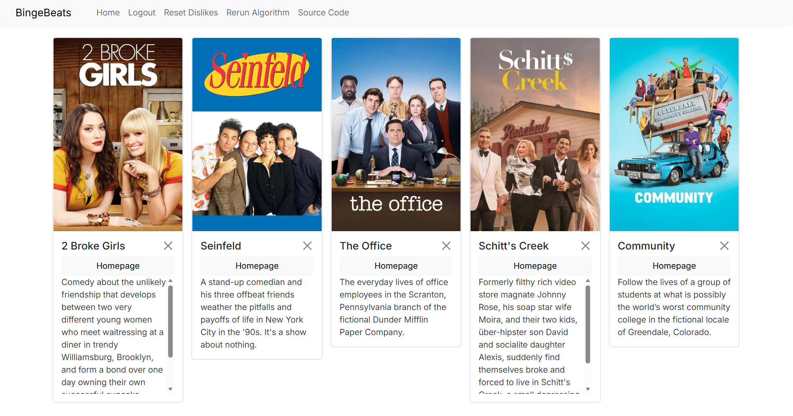
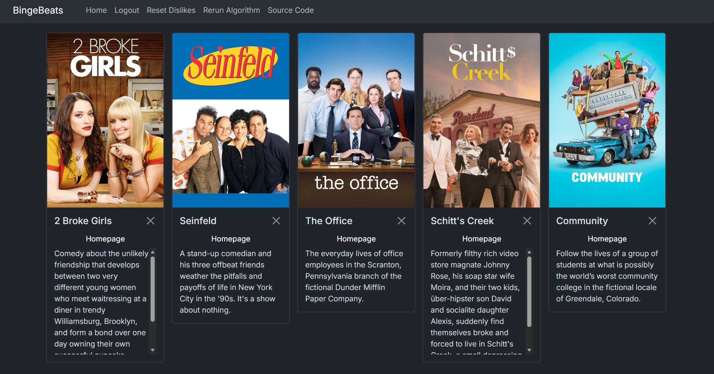

# BingeBeats

<p>

</p>
A fullstack application that uses SentenceTransformers on a user's Spotify data in order to provide personalized TV Show recommendations. Show data sourced from TMDB.

## Screenshots

<p>

<br>
<em>Light mode</em>
</p>
<p>

<br>
<em>Dark mode</em>
</p>

---

## Features

- **Spotify-Integrated TV Show recommendations**: Connects with your Spotify account and uses top artists/genres to generate personalized show recommendations.
- **Personalized Ranking Algorithm**: ML based recommendation engine rankes shows based on your musical taste. May be continuously updated as your listening habits evolve.
- **Dislike Management**: Users can mark shows they dislike. Disliked shows are automatically excluded from future recommendations.
- **User Profiles**: Users stay logged in with Django sessions. Recommendations and dislike history are stored securely in the backend.
- **Dark/Light Mode Support**: Automatically activated based on browser preferences.
- **Lightweight**: Easily run locally or via tunneling (ex. ngrok)

---

## Tech Stack

| Tool                      | Purpose                                 |
| ------------------------- | --------------------------------------- |
| **TypeScript**            | Type-safe Javascript                    |
| **React**                 | Modular UI components                   |
| **Next.js**               | Frontend React framework                |
| **Python**                | High-level language commonly used in ML |
| **Django**                | Batteries-included Python backend       |
| **PostgreSQL**            | Scalable SQL database                   |
| **SpotifyAPI**            | Spotipy wrapper to collect user data    |
| **Sentence Transformers** | Semantic text embeddings for NLP        |
| **scikit-learn**          | Compare vectors using cosine            |

---

## Installation

1. Clone this repository:

```bash
git clone
cd bingebeats
```

2. Install dependencies:

```bash
pip install -r requirements.txt
```

3. Build environment variables:

```bash
cd frontend
copy .env.example .env
cd ../backend
copy .env.example .env
```

After performing these commands please fill in the variables.

4. Run migrations:

```bash
python manage.py migrate
```

5. Create show JSON:
   This project uses a dataset from Kaggle to generate show data.

- Go to [Kaggle](https://www.kaggle.com/datasets/asaniczka/full-tmdb-tv-shows-dataset-2023-150k-shows)
- Download `TMDB_tv_dataset_v3.csv` and place it in the `backend/` folder.
- After placing the CSV, run the following command

```bash
python generate-shows.py
```

6. Start frontend/backend servers

```bash
cd ../frontend
npm install
npm run build
npm run start
cd ../backend
python manage.py runserver
```

If tunnelling either server feel free to alter the commands as needed.

## Permissions

This app requires the following permissions:

- **Access to Spotify account**: Access token is stored in a local, on-device cache by spotipy which may be disabled.
- **Third party cookies**: Store user account cookies to prevent repeated logins

## Project Structure

```
bingebeats/
├── frontend/
│   ├── lib/
│   │   ├── types.ts                     # Define Show type
│   │   ├── mappers.ts                   # Map show data from backend to frontend
│   │   └── api.ts                       # Send requests to backend API
│   ├── node_modules/                    # Installed frontend dependencies
│   ├── public/                          # Favicons
│   ├── homepage/
│   │   ├── useApi.ts                    # Homepage hooks
│   │   └── Homepage.tsx                 # Main page
│   ├── .next/
│   ├── app/
│   │   ├── page.tsx                     # Provides theme
│   │   └── layout.tsx                   # Metadata
│   ├── components/
│   │   └── ShowGrid.tsx                 # ShowGrid component
│   ├── package-lock.json                # Locks dependencies
│   ├── next.config.js                   # Next.js configuration
│   ├── tsconfig.json                    # Base Typescript configuration
│   ├── package.json                     # Dependencies and scripts
│   ├── .env.example                     # Frontend environment variable template
│   ├── next-env.d.ts                    # Next.js Typescript definitions
│   └── eslint.config.mjs                # Code linting
├── backend/
│   ├── core/                            # Core backend functionality
│   ├── algorithm/
│   │   ├── recommend_route.py           # Algorithm routing
│   │   ├── recommender.py               # Vector creation
│   │   └── embeddings.py                # Sentence Transformer use
│   ├── api/
│   │   ├── migrations/                  # Model history
│   │   ├── urls.py                      # API routing
│   │   ├── views.py                     # API requests
│   │   ├── __init__.py                  # Python packaging
│   │   ├── tests.py                     # Automated testing
│   │   ├── admin.py                     # Admin registration
│   │   ├── apps.py                      # Django config file
│   │   └── models.py                    # User model
│   ├── generate-shows.py                # Generate show JSON
│   ├── manage.py                        # Command-line utility to manage and run Django
│   └── .env.example                     # Backend environment variable template
├── assets/                              # App icons and screenshots
├── requirements.txt                     # App dependencies
├── .gitignore
└── README.md
```

## Privacy Policy

All personal data is stored locally (on your database).
All permissions are used strictly to perform what is expected.
